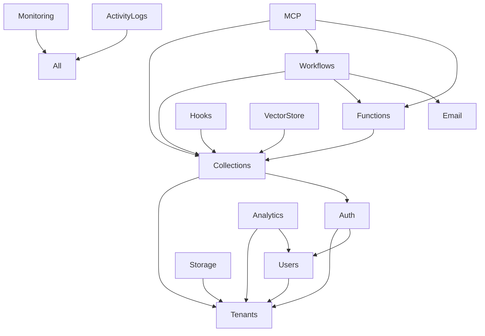

# 🏗️ Módulos de NexaBase

NexaBase está compuesto por **30+ módulos** que trabajan juntos para proporcionar una plataforma backend completa.

## Módulos Principales

### 🔐 Seguridad y Autenticación

| Módulo | Descripción | Estado |
|--------|-------------|--------|
| **[Auth](./auth.md)** | Autenticación JWT, API Keys, OAuth, 2FA | ✅ Producción |
| **[API Keys](./api-keys.md)** | Gestión de claves API con permisos | ✅ Producción |
| **[OAuth](./oauth.md)** | Google, GitHub authentication | ✅ Producción |
| **[Rate Limiting](./rate-limiting.md)** | Control de tasa de peticiones | ✅ Producción |

### 🏢 Multi-Tenancy

| Módulo | Descripción | Estado |
|--------|-------------|--------|
| **[Tenants](./tenants.md)** | Organizaciones y aislamiento | ✅ Producción |
| **[Plans](./plans.md)** | Planes y suscripciones | ✅ Producción |
| **[Users](./users.md)** | Gestión de usuarios | ✅ Producción |

### 📊 Datos y Colecciones

| Módulo | Descripción | Estado |
|--------|-------------|--------|
| **[Collections](./collections.md)** | Colecciones dinámicas con schemas | ✅ Producción |
| **[Storage](./storage.md)** | Almacenamiento de archivos (MinIO/S3) | ✅ Producción |
| **[Vector Store](./vector-store.md)** | Búsqueda vectorial para IA | ✅ Producción |
| **[Introspection](./introspection.md)** | Introspección de schema | ✅ Producción |

### ⚡ Automatización

| Módulo | Descripción | Estado |
|--------|-------------|--------|
| **[Workflows](./workflows.md)** | Automatización de procesos | ✅ Producción |
| **[Hooks](./hooks.md)** | Hooks en eventos del sistema | ✅ Producción |
| **[Functions](./functions.md)** | Funciones serverless | ✅ Producción |
| **[Webhooks](./webhooks.md)** | Webhooks salientes | ✅ Producción |
| **[Email](./email.md)** | Envío de correos transaccionales | ✅ Producción |
| **[Backup](./backup.md)** | Backups programados | ✅ Producción |

### 🔄 Tiempo Real y Notificaciones

| Módulo | Descripción | Estado |
|--------|-------------|--------|
| **[Realtime](./realtime.md)** | WebSockets y pub/sub | ✅ Producción |
| **[Notifications](./notifications.md)** | Notificaciones internas | ✅ Producción |

### 📈 Monitoreo y Analytics

| Módulo | Descripción | Estado |
|--------|-------------|--------|
| **[Analytics](./analytics.md)** | Métricas de uso | ✅ Producción |
| **[Monitoring](./monitoring.md)** | Health checks y alertas | ✅ Producción |
| **[Activity Logs](./activity-logs.md)** | Logging de actividades | ✅ Producción |

### 🤖 IA e Integración

| Módulo | Descripción | Estado |
|--------|-------------|--------|
| **[MCP](./mcp.md)** | Model Context Protocol | ✅ Producción |

### 🛠️ Herramientas de Desarrollo

| Módulo | Descripción | Estado |
|--------|-------------|--------|
| **[Dashboard](./dashboard.md)** | Dashboard principal | ✅ Producción |
| **[Developer Portal](./developer-portal.md)** | Portal para desarrolladores | ✅ Producción |
| **[SDK](./sdk.md)** | Generación de SDKs | ✅ Producción |
| **[Documentation](./documentation.md)** | Documentación automática | ✅ Producción |
| **[Testing](./testing.md)** | Herramientas de testing | ✅ Producción |

### ⚙️ Sistema y Administración

| Módulo | Descripción | Estado |
|--------|-------------|--------|
| **[Admin](./admin.md)** | Panel de administración | ✅ Producción |
| **[Configuration](./configuration.md)** | Configuración de la app | ✅ Producción |
| **[Middleware](./middleware.md)** | Middlewares personalizados | ✅ Producción |
| **[Notifications](./notifications.md)** | Sistema de notificaciones | ✅ Producción |

---

## Arquitectura de Módulos

```
┌─────────────────────────────────────────────────────────┐
│                    NEXABASE BACKEND                     │
├─────────────────────────────────────────────────────────┤
│                                                         │
│  ┌──────────────┐  ┌──────────────┐  ┌──────────────┐  │
│  │    Auth      │  │   Tenants    │  │   Users      │  │
│  │   Module     │  │   Module     │  │   Module     │  │
│  └──────┬───────┘  └──────┬───────┘  └──────┬───────┘  │
│         │                 │                 │          │
│         └─────────────────┼─────────────────┘          │
│                           │                            │
│              ┌────────────▼────────────┐               │
│              │   Collections Module    │               │
│              │   (Dynamic Schemas)     │               │
│              └────────────┬────────────┘               │
│                           │                            │
│         ┌─────────────────┼─────────────────┐          │
│         │                 │                 │          │
│  ┌──────▼───────┐  ┌──────▼───────┐  ┌──────▼───────┐  │
│  │  Workflows   │  │    Hooks     │  │  Functions   │  │
│  │   Module     │  │   Module     │  │   Module     │  │
│  └──────────────┘  └──────────────┘  └──────────────┘  │
│                                                         │
│  ┌──────────────┐  ┌──────────────┐  ┌──────────────┐  │
│  │   Storage    │  │    Vector    │  │     MCP      │  │
│  │   Module     │  │    Store     │  │   Module     │  │
│  └──────────────┘  └──────────────┘  └──────────────┘  │
│                                                         │
│  ┌──────────────┐  ┌──────────────┐  ┌──────────────┐  │
│  │   Analytics  │  │  Monitoring  │  │   Activity   │  │
│  │   Module     │  │   Module     │  │    Logs      │  │
│  └──────────────┘  └──────────────┘  └──────────────┘  │
│                                                         │
└─────────────────────────────────────────────────────────┘
```

---

## Módulos en Detalle

### Auth Module

**Responsable de:**
- Login/logout con JWT
- API Keys con hash SHA-256
- OAuth (Google, GitHub)
- 2FA/TOTP
- Refresh tokens
- Password reset

**Endpoints principales:**
```
POST   /api/v1/login
POST   /api/v1/refresh
POST   /api/v1/logout
GET    /api/v1/me
POST   /api/v1/keys
```

[Ver documentación completa →](./auth.md)

---

### Collections Module

**Responsable de:**
- Crear tablas dinámicas
- Schemas personalizables
- CRUD automático
- Validaciones
- Índices automáticos

**Endpoints principales:**
```
POST   /api/admin/collections
GET    /api/admin/collections/:name
PUT    /api/admin/collections/:name
DELETE /api/admin/collections/:name
GET    /api/collections/:name
POST   /api/collections/:name
```

[Ver documentación completa →](./collections.md)

---

### Workflows Module

**Responsable de:**
- Automatización de procesos
- Triggers (database, webhook, schedule, manual)
- Acciones (database, http, email, function, webhook)
- Condiciones y loops
- Reintentos y manejo de errores

**Endpoints principales:**
```
GET    /api/workflows
POST   /api/workflows
POST   /api/workflows/:id/execute
```

[Ver documentación completa →](./workflows.md)

---

### MCP Module

**Responsable de:**
- Model Context Protocol server
- 39+ herramientas para IA
- Integración con editores (Cursor, VS Code)
- Transporte SSE y HTTP Streamable

**Herramientas disponibles:**
- list_collections
- get_collection_schema
- create_collection
- get_collection_data
- insert_collection_data
- list_users
- list_workflows
- execute_workflow
- ... y 30+ más

**Endpoints:**
```
GET    /api/mcp/sse
POST   /api/mcp/sse
```

[Ver documentación completa →](./mcp.md)

---

## Dependencias entre Módulos



---

## Estado de los Módulos

| Estado | Significado |
|--------|-------------|
| ✅ Producción | Listo para usar en producción |
| 🚧 Beta | Funcional pero puede cambiar |
| 📝 Planificado | En desarrollo |

---

## Agregar Nuevo Módulo

### Estructura Recomendada

```
src/
└── nuevo-modulo/
    ├── nuevo-modulo.module.ts
    ├── nuevo-modulo.controller.ts
    ├── nuevo-modulo.service.ts
    ├── dto/
    │   ├── create.dto.ts
    │   └── update.dto.ts
    ├── entities/
    │   └── entidad.entity.ts
    └── interfaces/
        └── interfaces.ts
```

### Registro en App Module

```typescript
// src/app.module.ts
import { NuevoModuloModule } from './nuevo-modulo/nuevo-modulo.module';

@Module({
  imports: [
    // ... otros módulos
    NuevoModuloModule,
  ],
})
export class AppModule {}
```

---

## Contribuir

¿Quieres agregar un módulo? Sigue estas guías:

1. **Crea el módulo** siguiendo la estructura estándar
2. **Agrega tests** unitarios y de integración
3. **Documenta** todos los endpoints y funcionalidades
4. **Actualiza** este archivo con el nuevo módulo

---

**¿Falta algún módulo?** [Abrir issue →](https://github.com/nexabase/nexabase/issues)
